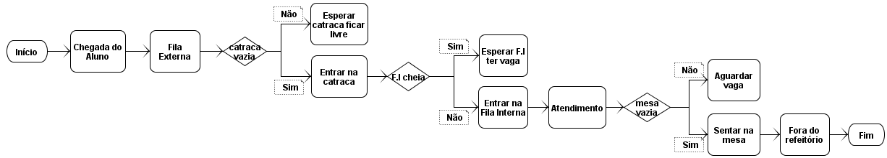
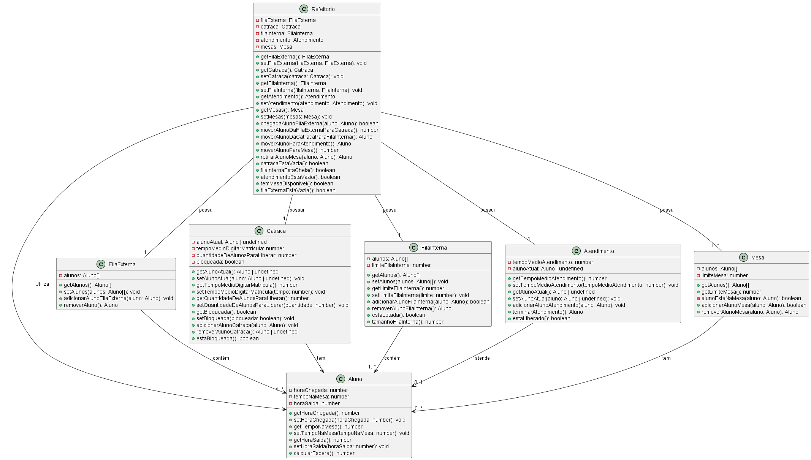
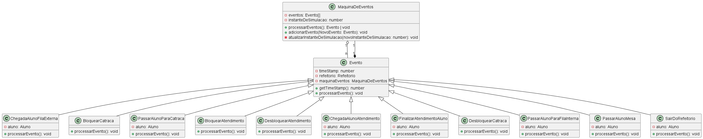

# Simulador de Fluxo de Refeitório (SFR)

Este projeto foi desenvolvido como requisito para a aprovação na disciplina de **Programação Orientada a Objetos e Engenharia de Software** do curso de **Tecnólogo em Análise e Desenvolvimento de Sistemas** do **IFPI/Campus Piripiri**. Ele consiste na modelagem de um simulador de fluxo de refeitório utilizando **TypeScript**, com base em um projeto elaborado pelo Professor Dr. [Iallen Gábio](https://github.com/iallengabio). O [Documento de Especificação de Requisitos / Documento de Design da Aplicação](https://docs.google.com/document/d/1mUOEwobqiFFIAUdnUSOnNeMWUZRFbhJcW_c7mQbH5Z4/edit?usp=sharing) detalham todos os requisitos necessários para a construção da aplicação.

## Estrutura das Pastas

A estrutura das pastas com os arquivos criados/alterados pela equipe está organizada da seguinte forma:

```
...

📦domain
 ┣ 📂data-management
 ┃ ┣ 📂Entities
 ┃ ┃ ┣ 📜simulation-parameters.ts
 ┃ ┃ ┣ 📜simulation-results.ts
 ┃ ┃ ┗ 📜simulation.ts
 ┃ ┗ 📜simulation-repository.ts
 ┣ 📂eventos
 ┃ ┣ 📜bloquearAtendimento.ts
 ┃ ┣ 📜BloquearCatraca.ts
 ┃ ┣ 📜chegadaAlunoAtendimento.ts
 ┃ ┣ 📜chegadaAlunoFilaExterna.ts
 ┃ ┣ 📜desbloquearAtendimento.ts
 ┃ ┣ 📜desbloquearCatraca.ts
 ┃ ┣ 📜evento.ts
 ┃ ┣ 📜finalizarAtendimentoAluno.ts
 ┃ ┣ 📜maquinaDeEventos.ts
 ┃ ┣ 📜passarAlunoMesa.ts
 ┃ ┣ 📜passarAlunoParaCatraca.ts
 ┃ ┣ 📜passarAlunoParaFilaInterna.ts
 ┃ ┗ 📜sairDoRefeitorio.ts
 ┣ 📂simulation-engine
 ┃ ┣ 📂util
 ┃ ┃ ┣ 📜random-generators.ts
 ┃ ┃ ┗ 📜simulator.ts
 ┃ ┗ 📜mock-simulator.ts
 ┗ 📂sistema
 ┃ ┣ 📜aluno.ts
 ┃ ┣ 📜atendimento.ts
 ┃ ┣ 📜catraca.ts
 ┃ ┣ 📜fila-externa.ts
 ┃ ┣ 📜fila-interna.ts
 ┃ ┣ 📜mesa.ts
 ┃ ┗ 📜refeitorio.ts

 ...
```

## Fluxograma - Funcionamento do Refeitório

A lógica para a implementação do funcionamento do refeitório está representada no seguinte fluxograma:

<p align="center">
  
</p>

## Diagramas - Funcionamento do Refeitório

# Diagramas de Sistemas

<p align="center">
  
</p>

# Diagrama de Eventos

<p align="center">
  
</p>

## Como Configurar e Executar o Projeto

Se quiser trabalhar localmente usando seu próprio IDE, pode clonar este repositório e enviar alterações. O único requisito é ter o **Node.js** e o **npm** instalados.

### Passos para executar o projeto:

```sh
# Passo 1: Clone o repositório usando a URL do Git do projeto.
git clone <SUA_URL_GIT>

# Passo 2: Acesse o diretório do projeto.
cd <NOME_DO_SEU_PROJETO>

# Passo 3: Instale as dependências necessárias.
npm i

# Passo 4: Inicie o servidor de desenvolvimento com recarregamento automático e pré-visualização instantânea.
npm run dev
```

## Tecnologias Utilizadas

Este projeto foi desenvolvido com as seguintes tecnologias:

- [Vite](https://vitejs.dev/)
- [TypeScript](https://www.typescriptlang.org/)
- [React](https://react.dev/)
- [shadcn/ui](https://ui.shadcn.com/)
- [Tailwind CSS](https://tailwindcss.com/)

## Conclusão

O projeto em questão estimulou a prática da **Programação Orientada a Objetos**, aliada a conhecimentos de **Engenharia de Software**, desempenhando um papel fundamental no crescimento acadêmico. A experiência de trabalhar em uma **perspectiva profissional**, integrando a ferramenta de gerenciamento de projetos **Jira** e a plataforma de hospedagem de código-fonte **GitHub**, elevou nosso nível de aprendizado, ampliando as possibilidades de aprofundamento na área.
